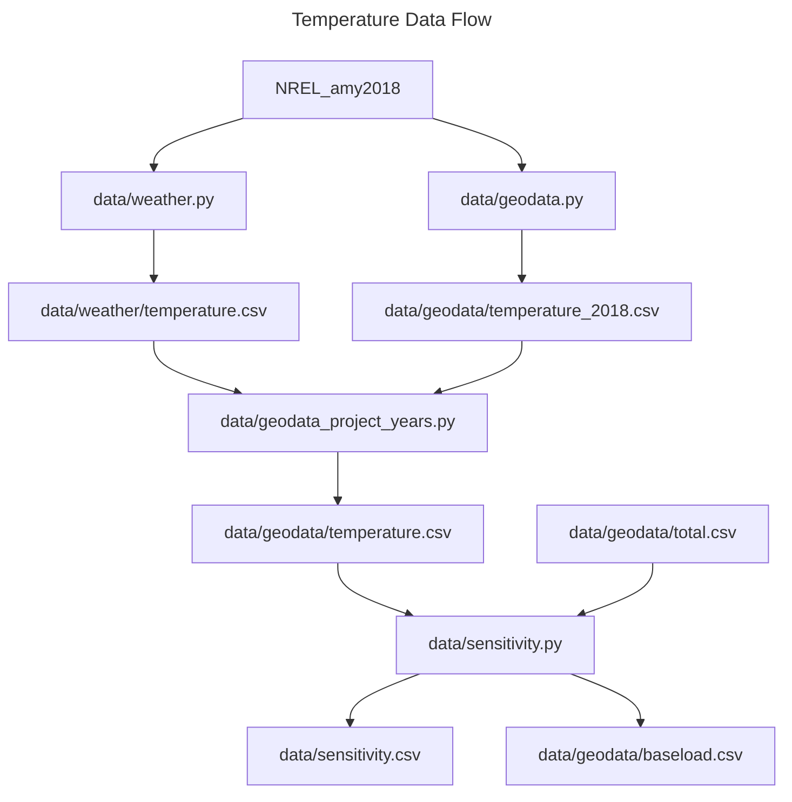
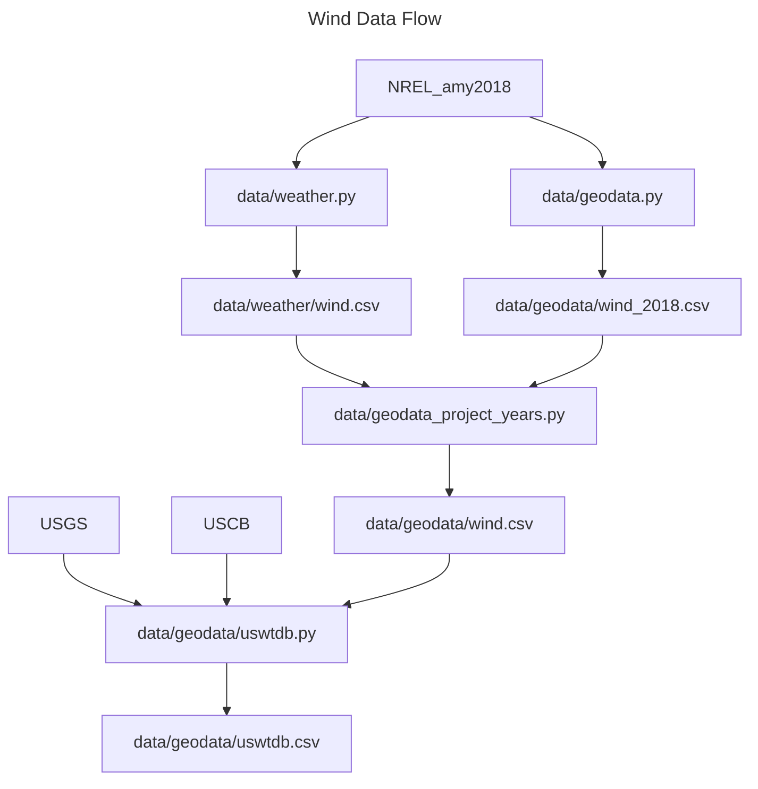

To update the GLM file, run the Makefile.

    make

# Data Flows

## Temperature Data

## Solar Data

## Wind Data

# Validation

To review the load model, run the following marimo app:

	marimo run bob.py

Bob is the subject matter expert who can tell whether your solution is any good
just by looking at it.

# Notes

The `nodes.csv` contains a list of all the WECC 240 bus model locations with duplicate locations removed (see `nodes.py` for node reduction methodology).

# Data Sources
1. `powerplants.csv`: https://hifld-geoplatform.hub.arcgis.com/datasets/9dd630378fcf439999094a56c352670d_0/explore
2. WECC 240 bus model: https://www.nrel.gov/grid/assets/downloads/wecc-osl.zip. Citation: *Developing a Reduced 240-Bus WECC Dynamic Model for Frequency Response Study of High Renewable Integration, 2020 IEEE Power Engineering Society Transmission and Distribution Conference and Exposition (2020)*
3. `wecc_emissions.kml`: https://s3-us-west-1.amazonaws.com/widap.chassin.org/index.html
4. `caiso_co2_intensity_2021.csv`: https://www.electricitymaps.com/data-portal/united-states-of-america#data-portal-form
