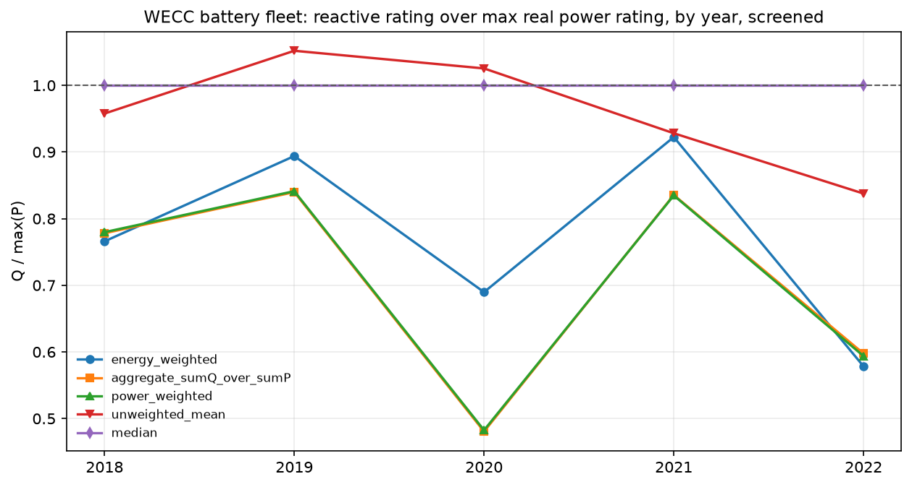
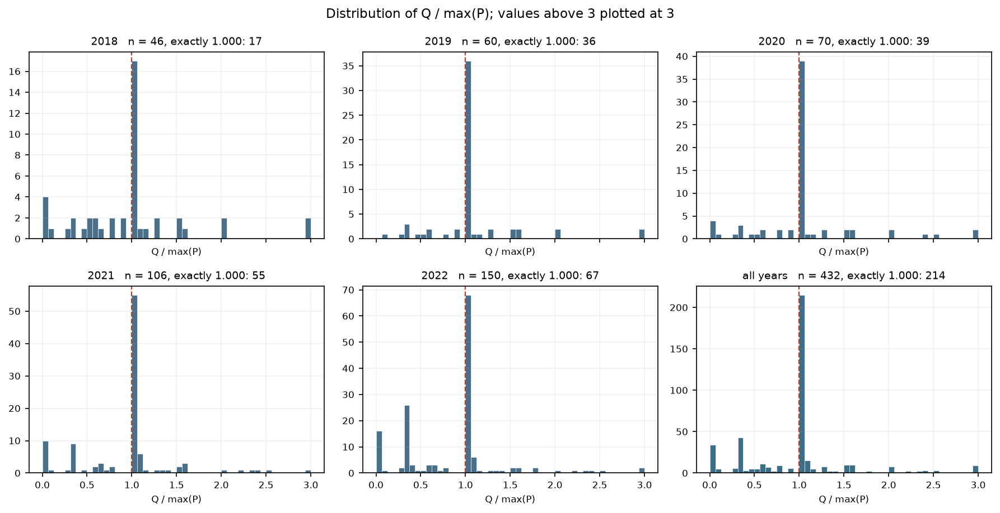
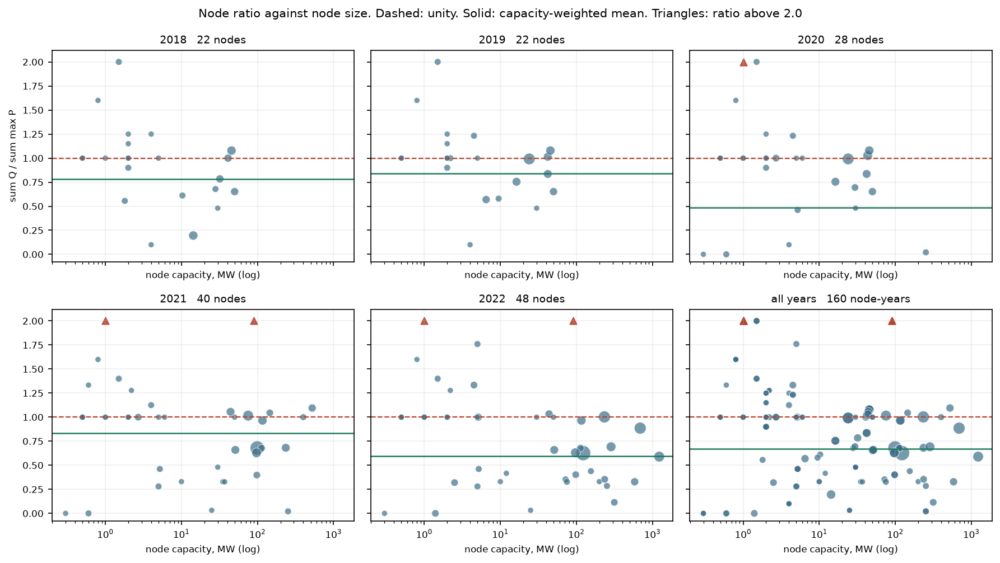
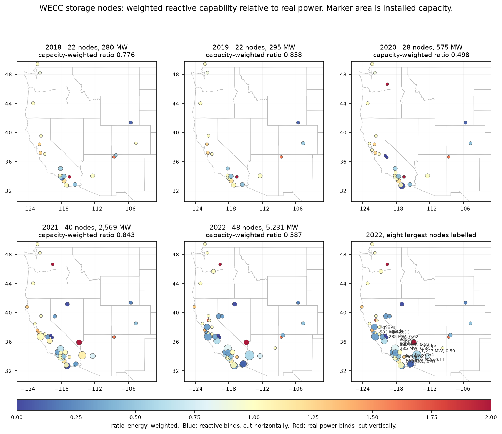
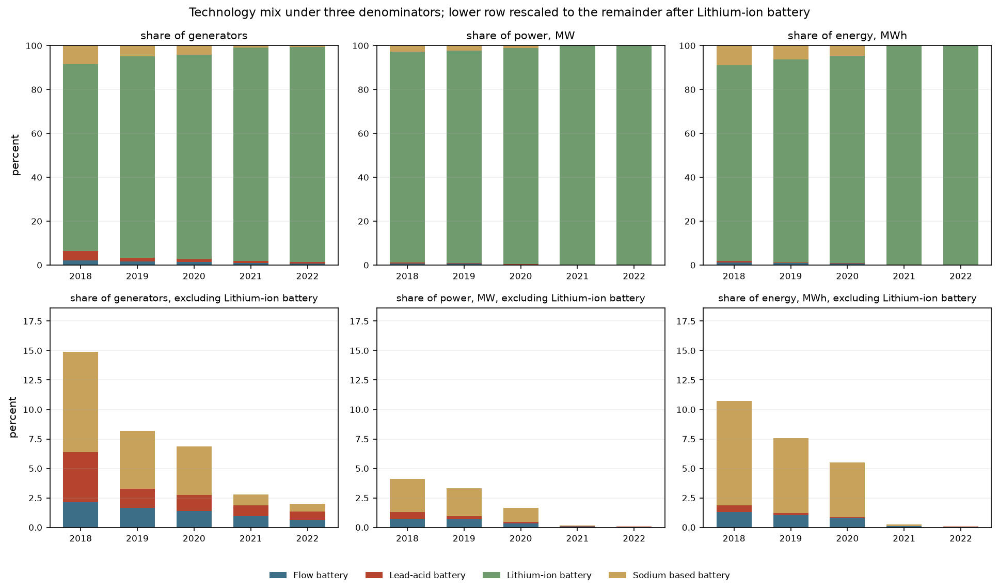
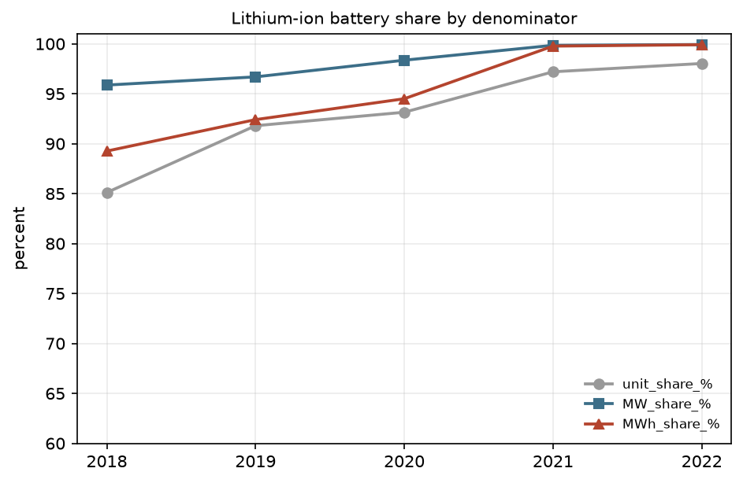
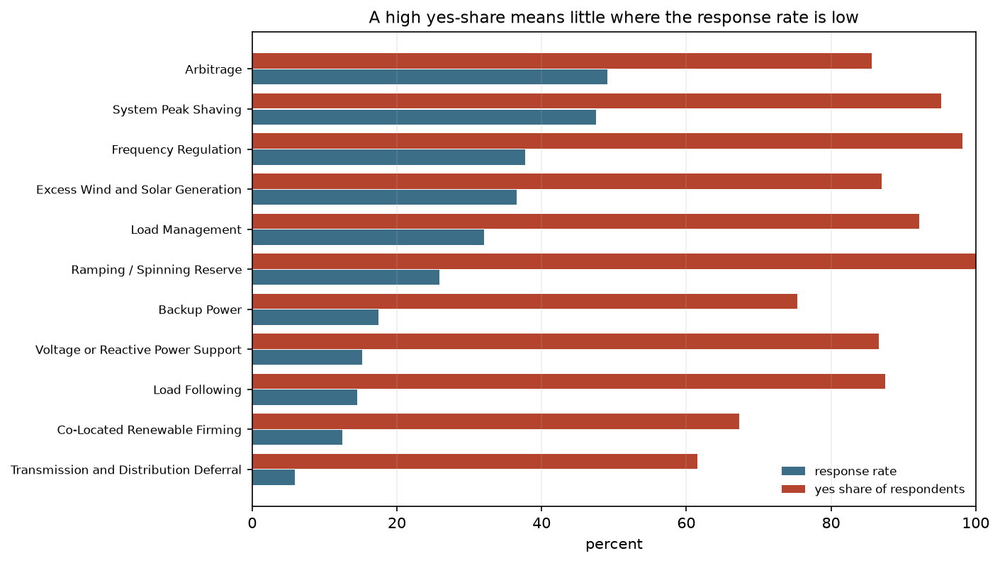
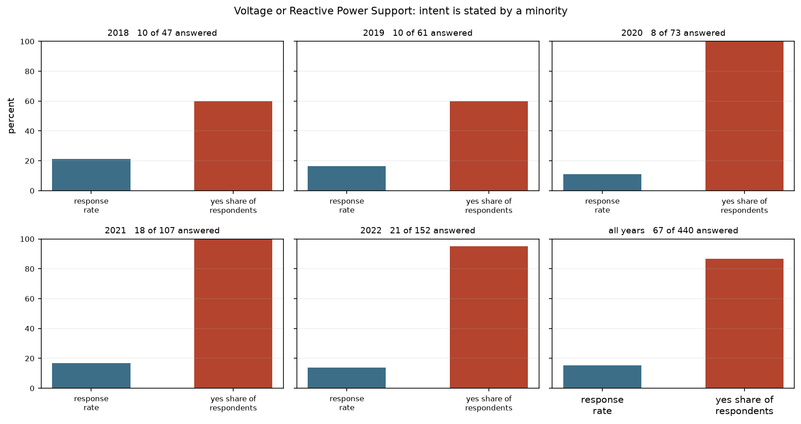

# Battery Data

This is the working directory for battery-related data and analysis in the
REGROW project.

## What goes here

Battery system data and analysis code relevant to the REGROW project: raw
datasets, processed/cleaned outputs, fixture files for testing, Python scripts,
and notebooks for data processing steps and numerical experiments. Examples:

* Battery capacity and specifications (by node, region, or technology class)
* Charge/discharge time series
* State-of-charge profiles
* Cost and degradation parameters
* Scripts that fetch, clean, or transform data
* Notebooks that run experiments or produce results figures

## Directory structure

```
data/batteries/
├── README.md          ← you are here
├── raw/               ← data as downloaded, unmodified (EIA-860 / EIA-923)
├── processed/         ← cleaned outputs: every table and figure lands here
└── notebooks/         ← marimo notebooks for the processing steps
```

Add subdirectories as the work warrants (e.g. a `fixtures/` folder for small,
stable test inputs). Feel free to add, rename, or reorganize — just keep this
README up to date so the next person can orient quickly.

## Adding data files to git

Data files under the [GitHub 100 MB file size limit](https://docs.github.com/en/repositories/working-with-files/managing-large-files/about-large-files-on-github)
can be committed directly and pushed to GitHub — no special tooling needed. For
files above that limit, coordinate with the team (options include Git LFS or
storing outside the repo and documenting the source here).

## Questions

Reach out to `bennetm [at] nlr [dot] gov` with any questions about the project
or this dataset area.

---

# Current contents: EIA battery storage for the WEC-240 model (2018–2022)

Scope throughout: **WECC only**, **2018–2022**, **EIA data only** (no CAISO in
this pass).

---

## What the WECC model consumes

Four files are downstream inputs. Everything else in `processed/` is either
supporting evidence for the choices below, or an intermediate kept so the
results can be audited back to source. A per-file manifest lives in
`processed/README.md`.

### Model specification — power, power limits, and device configuration

| File | Grain | Rows / nodes | Role |
|---|---|---|---|
| **`node_reactive_bounds_by_year.csv`** | node × year | 160 / 49 | The P–Q feasible region per node. `max_charge_MW` / `max_discharge_MW` bound real power, `reactive_MVAR` bounds reactive, `max_P_MW` with `reactive_MVAR` sizes the disc, `ratio_aggregate` selects the half-plane cut. |
| **`node_capacity_by_year.csv`** | node × year | 167 / 52 | Fleet inventory: nameplate MW and MWh, charge/discharge rates, plant count. Broader coverage than the bounds table — see *Coverage*. |
| **`technology_by_node_year.csv`** | node × year × technology | 172 / 50 | What chemistry sits at each node, and how much of it. |

### Downstream validation — energy totals and observed shapes

| File | Grain | Rows / nodes | Role |
|---|---|---|---|
| **`node_generation_by_month.csv`** | node × year × month | 1,908 / 50 | Reported charge, discharge and net generation. The observed monthly shapes that simulated storage dispatch is checked against, and the energy totals for true-up. |

**Weighting convention throughout: nameplate capacity is the modeling
parameter; reported energy is for true-up.**

The configuration tables are **annual**, because EIA-860 is an annual filing,
while the model wants a configuration for an arbitrary month. See open
question 1.

---

## Headline results

1. **The storage fleet grew roughly 18× in five years**, from ~286 MW at 22
   nodes to ~5,240 MW at 48 nodes, with the step change in 2021.
2. **The circular P–Q feasible region is not adequate on its own.** The
   capacity-weighted reactive-to-real power ratio is below unity in every year
   of the sample (pooled 0.672). A disc sized on real power and left uncut
   grants reactive headroom the fleet does not have.
3. **The apparent support for the disc is a filing artifact.** 49.5% of
   generator-years report a reactive rating *exactly* equal to their real power
   rating, while **zero** records fall between 0.9 and 1.0 — the shoulder a
   measured quantity would populate.
4. **Low-ratio nodes carry the capacity.** The capacity-weighted node mean sits
   below the unweighted mean in every year, and the ten largest nodes sit lower
   still. Averaging nodes without weighting overstates reactive headroom exactly
   where the storage is.
5. **The correct region is per node, not fleet-wide.** 29 of 160 node-years bind
   on real power rather than reactive. `node_reactive_bounds_by_year.csv`
   supplies both bounds per node so the model can compose the right one.
6. **One chemistry describes almost every node.** The fleet is 99.91%
   lithium-ion by energy in 2022, 147 of 161 node-years are lithium-dominated,
   and the capacity **not** held by each node's dominant chemistry is under
   0.65% of the fleet in every year. `technology_by_node_year.csv` carries the
   full breakdown where it matters.
7. **The declared-application flags cannot carry evidentiary weight.** No field
   is answered by even half the fleet (response rates 5.9%–49.1%, median 25.9%),
   and respondents answer `Y` 61–100% of the time. Non-response, not `N`, is how
   a negative is expressed.

## The two passes

The work is in two passes over the same EIA source, at two different grains,
answering two different questions.

**Pass 1 — how much storage is there, and where?**
Plant grain. Every battery plant is labeled with its nearest WEC-240 node by
great-circle distance, then capacity and monthly operations are aggregated **by
node**. Produces the capacity and generation time series the model plays back.

**Pass 2 — what shape is the feasible region, and what is in it?**
Generator grain. The nodal dispatch model represents each storage aggregate as
a convex region in the P–Q plane. Pass 1 sizes it; pass 2 asks whether the
conventional circular region is the right shape, supplies the per-node bounds
that define it, and reports the chemistry present at each node. Chemistry and
declared applications are settled in the same pass because they come from the
same generator-level records.

```
EIA-860 + EIA-923 ──► build_battery_panel.py ──► battery_panel_2018_2022.csv
                                                          │
                                                   nearest_node.py
                                                          │
                    ┌─────────────────────────────────────┼──────────────────────────┐
                    ▼                                     ▼                          ▼
             plant_to_node.csv              node_capacity_by_year.csv    node_generation_by_month.csv
            (plant → node lookup)                 [MODEL INPUT]               [VALIDATION]
                    │
                    │ node labels only; no capacity figure is reused
                    ▼
EIA-860 ──────► build_unit_table.py ──► battery_units_2018_2022.csv
                                        (generator-year grain)
                                                   │
                          ┌────────────────────────┴────────────────────────┐
                          ▼                                                 ▼
              reactive_power_ratio.py                         tech_and_applications.py
        node_reactive_bounds_by_year.csv                  technology_by_node_year.csv
                  [MODEL INPUT]                                 [MODEL INPUT]
                                                          + node summary, fleet mix,
                                                            application flags
```

Pass 2 borrows only the node label from pass 1. Nothing numeric crosses between
them; every capacity figure in pass 2 is rebuilt from EIA-860 at generator
grain, because the pass-1 panel aggregates with `groupby`–`sum`, which is
correct for capacity and destroys the per-generator attributes pass 2 needs.

## Files

**`notebooks/`** — all [marimo](https://marimo.io) notebooks: each variable is
defined in exactly one cell, cell-local names are underscore-prefixed, and
multi-step logic lives inside functions. Every path is resolved from the
notebook's own location via `mo.notebook_dir()`, so the notebooks run from a
fresh clone with no editing and regardless of the working directory.

| File | Pass | Does |
|---|---|---|
| `build_battery_panel.py` | 1 | EIA-860 + EIA-923 → monthly plant panel |
| `nearest_node.py` | 1 | WECC filter, nearest-node match, aggregation by node |
| `build_unit_table.py` | 2 | EIA-860 → generator-year unit table |
| `reactive_power_ratio.py` | 2 | Reactive-to-real power ratio; per-node P–Q bounds |
| `tech_and_applications.py` | 2 | Per-node chemistry, fleet mix, declared applications |

Run in this order — step 3 reads what step 2 writes:

```bash
cd data/batteries/notebooks
marimo edit build_battery_panel.py     # 1
marimo edit nearest_node.py            # 2
marimo edit build_unit_table.py        # 3
marimo edit reactive_power_ratio.py    # 4
marimo edit tech_and_applications.py   # 5
```

**`processed/`** — tables

| File | Grain | Rows | Description |
|---|---|---|---|
| `node_capacity_by_year.csv` | node × year | 167 | **Model input.** MW, MWh, charge/discharge rates, plant count |
| `node_reactive_bounds_by_year.csv` | node × year | 160 | **Model input.** P and Q bounds per node |
| `technology_by_node_year.csv` | node × year × technology | 172 | **Model input.** Chemistry breakdown per node, with within-node shares |
| `node_generation_by_month.csv` | node × year × month | 1,908 | **Validation.** Charge, discharge, net gen (long format) |
| `technology_node_mixing.csv` | node × year | 161 | Node summary rolled up from the breakdown: dominant chemistry, its share, mixed flag |
| `battery_units_2018_2022.csv` | generator × year | 440 | Pass-2 base table, 36 columns |
| `fleet_reactive_ratio_by_year.csv` | year | 5 | Five estimators of Q / max(P), screened |
| `node_ratio_weighting_by_year.csv` | year | 5 | Weighted against unweighted node means, top-10 concentration |
| `reactive_screen_sensitivity.csv` | threshold | 7 | Sensitivity of the headline figures to the screen threshold |
| `technology_mix_by_year.csv` | year × technology | 20 | Fleet mix under three denominators (units, MW, MWh) |
| `applications_summary.csv` | flag | 11 | Declared applications with response rates |
| `applications_by_year.csv` | flag × year | 55 | The same, by year |
| `plant_to_node.csv` | plant | 149 | Which node each WECC plant matched to, and the distance |
| `plant_923_not_in_860.csv` | plant × year | 41 | Orphan log — see data-quality item 3 |
| `battery_panel_2018_2022.csv` | plant × month | 12,733 | Intermediate: full-US panel, EIA-860 + EIA-923 joined |
| `battery_panel_labeled.csv` | plant × month | 8,251 | Intermediate: WECC panel with geohash label attached |

**`processed/`** — figures

| File | From | Shows |
|---|---|---|
| `fig_ratio_by_year.png` | `reactive_power_ratio` | Five estimators of Q / max(P), by year |
| `fig_ratio_distribution.png` | `reactive_power_ratio` | Distribution of the ratio, per year |
| `fig_node_capacity_vs_ratio.png` | `reactive_power_ratio` | Node ratio against node size (log MW) |
| `fig_node_map.png` | `reactive_power_ratio` | Nodes on the map; area = capacity, colour = ratio |
| `fig_technology_mix.png` | `tech_and_applications` | Mix under three denominators |
| `fig_lithium_share.png` | `tech_and_applications` | Dominant-chemistry share under each denominator |
| `fig_application_response.png` | `tech_and_applications` | Response rate against yes-share, per flag |
| `fig_reactive_application.png` | `tech_and_applications` | Reactive support flag, per year |

## Dependencies

`raw/utils.py` supplies `geohash()`, `nearest2()` and `haversine_distance()`;
`raw/nodes.csv` holds the unique WEC-240 node locations with `geocode` +
`Lat` / `Long`. `nearest_node.py` prepends `raw/` to `sys.path` so `utils` is
importable from the notebook directory.

One environment note: `utils.py` reads `HOME` at import time and imports `psm3`
at the top. On Windows neither is available, so the imports cell of
`nearest_node.py` sets a `HOME` fallback and stubs out `psm3`. This is an
environment shim only — it changes no calculation.

## Raw data

`raw/` holds the EIA workbooks as downloaded, unmodified, plus the two lookup
files and the state boundary layer used as a map backdrop:

```
raw/EIA860/eia860{YEAR}/2___Plant_Y{YEAR}.xlsx
raw/EIA860/eia860{YEAR}/3_4_Energy_Storage_Y{YEAR}.xlsx
raw/EIA923/EIA923_Schedules_2_3_4_5_M_12_{YEAR}_Final_Revision.xlsx
raw/nodes.csv
raw/utils.py
raw/us_states.geojson
```

Years used: 2018, 2019, 2020, 2021, 2022.

- EIA-860: https://www.eia.gov/electricity/data/eia860/
- EIA-923: https://www.eia.gov/electricity/data/eia923/

---

# Pass 1 — plant → node aggregation

## Method

**Step 1 — monthly panel (EIA-860 × EIA-923).**
EIA-860 gives the inventory: which plants hold batteries, where they are
(lat/long), how big they are. The filter is `Prime Mover == "BA"`, which keeps
batteries and excludes flywheels (FW), compressed air (CP), and so on. A plant
may hold several battery generators, so capacity is summed to plant level and a
`Generator Count` is recorded.

EIA-923 gives the operations. EIA treats electricity as the *fuel* for storage,
so the column semantics are:

| EIA-923 column | Meaning here |
|---|---|
| `Quantity {month}` | gross **charge** (MWh) |
| `Grossgen {month}` | gross **discharge** (MWh) |
| `Netgen {month}` | discharge − charge (usually negative) |

The 12 wide monthly columns are reshaped to long — one row per plant-month. The
join uses EIA-860 as the left anchor, because only 860 carries coordinates, and
coordinates are what the node match needs. Plants present in 860 but absent from
923 survive the left join as a single row with a null month; they carry capacity
but no operations, and the aggregation below handles them correctly.

**Step 2 — nearest-node match.**
Many WEC-240 graph nodes are co-located at the same site, so the 243 graph nodes
collapse to ~126 distinct physical locations in `nodes.csv` (where the geohash
column is named `geocode`). The match uses the repo's own `utils.geohash()` to
encode each plant's lat/long and `utils.nearest2()` to find the closest node,
keeping the whole chain on the repo's geohash convention rather than introducing
a second distance implementation. `utils.nearest2()` returns **meters**; the
notebook converts to km.

The WECC filter is applied *first*, before matching. This is the electrically
correct footprint: a pure distance cut would wrongly admit ERCOT (Texas) and MRO
(Midwest) plants sitting near the western edge, and would force Hawaii onto a
California node. `match_dist_km` is kept as a data-quality flag, not a filter —
nothing is dropped on distance.

**Step 3 — aggregate by node.**
Capacity is a per-plant-*year* attribute, constant month to month, so the code
takes `.first()` per (node, year, plant) *before* summing across the plants at
that node — otherwise the 12 monthly rows would multiply capacity by 12.

Generation uses `sum(min_count=1)` so a node-month where *every* plant was
missing from EIA-923 stays `NaN` rather than collapsing to `0`. "Did not report"
and "genuinely zero" are different facts.

## Results

**Match** — 149 WECC battery plants onto 52 distinct node locations. Match
distance: median 21.8 km, mean 46.1 km, max 442.7 km; 15 plants sit more than
100 km from their nearest node (see data-quality item 5).

**Capacity table** — 167 rows, 52 nodes.

| Year | Nameplate MW | Nameplate MWh |
|---|---|---|
| 2018 | 285.6 | 630.1 |
| 2019 | 320.2 | 787.6 |
| 2020 | 598.3 | 1,059.6 |
| 2021 | 2,584.1 | 7,127.3 |
| 2022 | **5,239.8** | **17,831.8** |

The fleet grows roughly 18× in power over five years, with the step change in
2021 — which matches EIA's published narrative for WECC storage build-out. The
2022 total reconciles exactly with the pre-aggregation WECC plant total, which
confirms nothing is lost or double-counted in the groupby.

**Generation table** — 1,908 rows, 50 nodes. Discharge divided by charge rises
monotonically to 2021 and then flattens:

| Year | 2018 | 2019 | 2020 | 2021 | 2022 |
|---|---|---|---|---|---|
| discharge ÷ charge | 78.9% | 82.5% | 84.8% | 86.8% | 86.1% |

72.9% of node-months have negative net generation, which is physically correct:
charging exceeds discharging by the losses. 8.5% of node-months are `NaN` — see
data-quality item 2.

---

# Pass 2 — generator-level unit table, the P–Q region, and per-node chemistry

## Why the grain changes

Storage technology, enclosure type, the nameplate reactive power rating and the
eleven declared-application flags are all **generator-level** facts, and several
plants hold more than one battery generator. Aggregating to the plant first, as
pass 1 does, destroys them. Pass 2 therefore rebuilds from EIA-860 at generator
grain and aggregates to the node once, downstream, where it is auditable.

## Step 1 — `build_unit_table.py`

One row per (Plant Code, Generator ID, Year). Reads the same
`3_4_Energy_Storage_Y{YEAR}.xlsx` workbooks as pass 1.

**Column resolution.** EIA header text moves between vintages — stray
whitespace, embedded newlines, unit suffixes. Columns are matched on a
normalised key plus a prefix, so `Nameplate Reactive Power Rating` also catches
the vintage that appends `(MVAR)`. Every year's load prints its own row count
and any column it failed to find, so a vintage that renames a field cannot pass
unnoticed as silent nulls.

**Scope decisions.** Each is stated in the notebook next to the count it
changes, so the scope can be widened later without re-deriving why it was
narrowed.

| Decision | Rationale |
|---|---|
| `Prime Mover == "BA"` | Same battery filter as pass 1; excludes FW, CE, CP, PS |
| `Status ∈ {OP, SB}` | EIA-860 Instructions Table 4 records **availability**, not presence. SB is available but not normally used, and is dispatchable; OS and OA are out of service for the reporting year. Summing the latter into a nodal bound lets the model schedule capacity that cannot respond. Node-years lost to the filter are named, not silently dropped. |
| Reactive rating read as **MVAR**, not MVA | EIA-860 Instructions line 38 specifies MVAR. Under an MVA reading, S ≥ P holds identically and a rating above the real power rating would carry no information; under MVAR it is a statement about converter hardware. This is what makes the Q > P cases substantive rather than arithmetic. |
| Blank flag ≠ `N` | The eleven application flags are voluntary. A blank means the operator did not answer, not that the answer is no. Kept distinct throughout. |

**Output:** 440 generator-years · 146 plants · 50 nodes. 36 columns: five
numeric ratings (capacity MW, energy MWh, max charge, max discharge, reactive
MVAR), four technology codes, one enclosure code, eleven application flags,
plus identifiers and the node label joined from `plant_to_node.csv`.

## Step 2 — `reactive_power_ratio.py`

### The question

The conventional storage feasible region is the converter thermal limit
P² + Q² ≤ S² — a disc of radius S. Heating depends on total current and is
indifferent to phase angle, which is what makes the disc the right primitive.
But the disc reaches S on both axes, so adopting it asserts that every unit's
reactive rating equals its real power rating. That assertion is testable:

```
r = Q_nameplate / max(P_charge, P_discharge)
```

| | Implication for the region |
|---|---|
| r ≈ 1 | The disc is correct as specified |
| r < 1 | Reactive binds first — intersect with \|Q\| ≤ Q_max |
| r > 1 | Real power binds first — intersect with \|P\| ≤ P_max |

The disc is sized on `max(P_max, Q_max)` and cut at `min(P_max, Q_max)`, so r
fixes the *orientation* of the cut but not the region. Both bounds must be
carried per node.

### Method

- **Denominator** is `max(charge, discharge)` per generator. The two directional
  ratings are usually equal; where they differ, the larger is the binding real
  power limit and therefore the right scale.
- **Zero is data.** A reported 0 MVAR declares no reactive capability and is
  retained with ratio 0. Only absent values are excluded. Q/P is used rather
  than P/Q because the latter is undefined at those rows.
- **Five estimators** are reported side by side: energy-weighted,
  power-weighted, unweighted mean, median, and the aggregate ΣQ / Σmax P. They
  disagree, and the disagreement is the finding. The aggregate is what a nodal
  model realises — one node, one reactive budget, one power budget.
- **Filing screen.** Records with r > 10 are treated as units or decimal errors.
  The notebook prints every excluded record in full, and the sensitivity of every
  headline number to the threshold is reported in
  `reactive_screen_sensitivity.csv`.

Record accounting: 440 read → 3 with the reactive rating absent, 20 declaring
zero (retained) → **437 with a defined ratio** → 5 removed by the screen →
**432 in the headline numbers**.

### Result 1 — the uncut disc is inadequate in every year



| Year | Generators | Energy-wtd | Power-wtd | Unweighted | Median | Aggregate ΣQ/ΣP |
|---|---|---|---|---|---|---|
| 2018 | 46 | 0.766 | 0.780 | 0.958 | 1.000 | 0.778 |
| 2019 | 60 | 0.894 | 0.841 | 1.052 | 1.000 | 0.840 |
| 2020 | 70 | 0.690 | 0.483 | 1.025 | 1.000 | 0.481 |
| 2021 | 106 | 0.922 | 0.835 | 0.928 | 1.000 | 0.836 |
| 2022 | 150 | 0.578 | 0.594 | 0.838 | 1.000 | 0.598 |
| **pooled** | **432** | **0.685** | **0.670** | 0.933 | 1.000 | **0.672** |

Every year lies below unity on every capacity-weighted estimator. The horizontal
restriction |Q| ≤ Q_max is required, not optional. Note also that the median sits
at exactly 1.000 in all five years while the weighted estimators do not — that
gap is the subject of result 2.

### Result 2 — the near-unity mass is a spike, not a mode



53.2% of screened generator-years lie within ten percent of unity, but 49.5%
report **exactly 1.000**, and **zero records** sit strictly between 0.9 and 1.0
— the shoulder a measured quantity would populate. A reactive rating equal to
the real power rating to the last digit is more consistent with the field being
copied across than with converter capability.

The median of 1.000 is therefore a property of the filings, not of the hardware.
It should be discounted as evidence for the disc rather than counted in its
favour, and the capacity-weighted estimators — which are driven by the large
units that do report distinct values — are the ones to quote.

### Result 3 — low-ratio nodes carry the capacity



| Year | Nodes | Unweighted | Capacity-weighted | Top-10 share of MW | Top-10 weighted |
|---|---|---|---|---|---|
| 2018 | 22 | 0.922 | 0.780 | 93% | 0.770 |
| 2019 | 22 | 0.963 | 0.842 | 92% | 0.828 |
| 2020 | 28 | 0.910 | 0.483 | 94% | 0.452 |
| 2021 | 40 | 0.866 | 0.835 | 81% | 0.792 |
| 2022 | 48 | 0.805 | 0.598 | 80% | 0.547 |

The capacity-weighted mean is below the unweighted mean in every year, and the
ten largest nodes — which hold 80–94% of the megawatts — sit lower still. An
unweighted read of the node distribution overstates reactive headroom precisely
where the storage is.

Weighting convention: **nameplate capacity is the modeling parameter; reported
energy is for true-up.** Node-level ratios in the deliverable are weighted by
nameplate MW.

### Result 4 — the orientation is not uniform across nodes



Marker area is installed capacity; colour is the node ratio. The large markers
that appeared in 2021–2022 are predominantly at the low end of the colour scale,
which is the spatial form of result 3.

But the fleet total is not a rule that holds node by node: **29 of 160
node-years lie above 1.1** and bind on real power rather than reactive, and 87
of 437 generator-years report a reactive rating above their real power rating.
Both half-planes must be composed from the per-node bounds and the side selected
from the data — not hard-coded from the fleet average.

Two further shapes appear in the per-node bounds:

- **17 node-years** have asymmetric charge and discharge bounds, so the box on
  the real power variable is not symmetric about the origin.
- **6 node-years** have zero reactive capability, where the region degenerates
  to a segment of the real power axis and no scaling of a disc reproduces it.

### Result 5 — the screen matters; its threshold does not

| Threshold on r | Generators | Dropped | Energy-wtd | Aggregate | Unweighted |
|---|---|---|---|---|---|
| none | 437 | 0 | 0.692 | 0.679 | 1.065 |
| 20 | 437 | 0 | 0.692 | 0.679 | 1.065 |
| **10 (adopted)** | **432** | **5** | **0.685** | **0.672** | **0.933** |
| 5 | 432 | 5 | 0.685 | 0.672 | 0.933 |
| 3 | 431 | 6 | 0.679 | 0.665 | 0.926 |
| 2 | 413 | 24 | 0.632 | 0.628 | 0.850 |

Across an order of magnitude of candidate thresholds — 20 down to 3 — the pooled
aggregate moves between 0.665 and 0.679 and the energy-weighted figure between
0.679 and 0.692, about one point. The decision to screen at all is load bearing;
the choice of threshold is not.

## Step 3 — `tech_and_applications.py`

Per-node chemistry and the declared applications, from the same unit table.

### Technology, at two grains

The dispatch model configures one aggregate battery per node, so it needs to
know what is at that node. Two tables answer that, and the second is a rollup of
the first, so they cannot disagree.

**`technology_by_node_year.csv`** — one row per (Year, geohash, technology).
The full breakdown: `generators`, `nameplate_MW`, `energy_MWh`, and the within
node-year shares `share_MW` and `share_MWh`. Each node-year's shares sum to 1
across its technologies. Long rather than wide, because the set of technologies
present changes between years and a wide table would carry a column of zeros for
every chemistry absent from a given node-year.

**`technology_node_mixing.csv`** — one row per (Year, geohash).
`technology_dominant` is the chemistry holding the most nameplate MW at that
node, `dominant_share_MW` is how much of the node it holds, and `mixed` is true
where more than one chemistry is present. Capacity is the weight rather than
generator count, because the model acts on capacity: a node can hold one large
unit of one chemistry beside several small units of another.

`dominant_share_MW` is what says whether the label can be used on its own. A
node at 0.99 and a node at 0.51 are different facts and the label alone hides
which one applies.

### The fleet mix

The mix is reported under **three denominators** — generator count, nameplate
power, nameplate energy — which disagree substantially, and the disagreement is
what determines which may be quoted.



The lower row of the figure repeats the upper one with the dominant chemistry
removed and the axis rescaled, because at these shares the remainder is a line
a few pixels tall at full scale.



**Findings.**

- **Every one of the 440 generator-years declares exactly one storage
  technology** — no generator names two, three or four. The mix is a partition,
  and no apportionment rule between co-declared chemistries is required.
- **Coverage is complete**: 100% of generator-years, 100% of MW and 100% of MWh
  carry a declared chemistry, so the mix describes the fleet rather than a
  subset of it.
- Four codes appear across the five years: **LIB** (lithium-ion, 417
  generator-years), **NAB** (sodium based, 12), **PBB** (lead acid, 6) and
  **FLB** (flow, 5).
- **Lithium-ion dominates, and increasingly so.** The three denominators
  disagree by enough to matter:

| Year | Generators | by count | by power | by energy |
|---|---|---|---|---|
| 2018 | 40 of 47 | 85.11% | 95.87% | 89.26% |
| 2019 | 56 of 61 | 91.80% | 96.69% | 92.41% |
| 2020 | 68 of 73 | 93.15% | 98.36% | 94.50% |
| 2021 | 104 of 107 | 97.20% | 99.85% | 99.77% |
| 2022 | 149 of 152 | **98.03%** | **99.93%** | **99.91%** |

  In 2022 the non-lithium remainder is 1.97% of generators but only 0.07% of
  power and 0.09% of energy — three generators totalling 3.8 MW. Reading the
  count column alone overstates the remainder by a factor of about 25.

### How mixed the nodes actually are

161 node-years, 50 nodes. Dominant chemistry: lithium-ion at 147 node-years,
sodium based at 7, lead acid at 5, flow at 2.

**11 of 161 node-years hold more than one chemistry**, and the notebook reports
their pooled capacity as 1,070.6 of 8,975.7 MW (11.93%). Two cautions on reading
that figure, both of which point the same way:

- The pooled denominator sums nameplate capacity over five years, which counts
  the same fleet five times, and is dominated by the last year. Per year the
  share at mixed nodes is 5.7%, 9.6%, **50.4%**, 13.7%, 7.2% — the pooled number
  hides that half the 2020 fleet sat at chemically mixed nodes.
- `mixed` is binary and counts the whole node. At `9muccv` that means 252 MW is
  counted as mixed when 250 MW of it is lithium-ion. The operative quantity is
  the capacity **not** held by the dominant chemistry, which is far smaller:

| Year | Fleet MW | At mixed nodes | Not at dominant chemistry |
|---|---|---|---|
| 2018 | 281.2 | 5.7% | 1.8 MW (0.64%) |
| 2019 | 295.8 | 9.6% | 1.5 MW (0.51%) |
| 2020 | 596.3 | 50.4% | 3.5 MW (0.59%) |
| 2021 | 2,569.6 | 13.7% | 3.0 MW (0.12%) |
| 2022 | 5,232.8 | 7.2% | 3.0 MW (0.06%) |

So `technology_dominant` is an accurate description of essentially the whole
fleet — the mislabelled capacity is under 0.65% in every year. The two node-years
where the label genuinely does not describe the node are `9we1bp` 2018
(dominant share 0.5556) and `9q97v8` 2019–2020 (0.8889). Both are small.

> The per-year figures above are computed from `technology_node_mixing.csv`.
> The notebook currently prints only the pooled figure; see open question 5.

### Declared applications

Eleven voluntary Y/N flags. One of them — *Voltage or Reactive Power Support* —
is the only field in which an operator states whether the installation is
intended to provide voltage support at all, and is therefore the one independent
check on the four-quadrant assumption that `reactive_power_ratio.py` examines
from the ratings instead.

Three proportions are reported per field because they answer different
questions: **response rate** (how far apart the two populations are),
**yes-share of respondents** (describes a self-selected minority), and
**yes-share of the fleet**. Quoting the second without the first overstates the
evidence by the reciprocal of the response rate. Rows are ordered by response
rate for the same reason.



The gap between the paired bars is the point: a long yes-share beside a short
response rate is an application that looks universal and was answered by almost
nobody.



**Findings.**

- 4,840 flag cells were parsed and **not one** is anything other than `Y`, `N`
  or empty, so non-response is unambiguous.
- **Response rates range from 5.9% to 49.1%, median 25.9%.** Not a single field
  is answered by even half the fleet.

| Application | Y | N | blank | response rate | yes-share of respondents |
|---|---|---|---|---|---|
| Arbitrage | 185 | 31 | 224 | 49.1% | 85.6% |
| System Peak Shaving | 199 | 10 | 231 | 47.5% | 95.2% |
| Frequency Regulation | 163 | 3 | 274 | 37.7% | 98.2% |
| Excess Wind and Solar Generation | 140 | 21 | 279 | 36.6% | 87.0% |
| Load Management | 130 | 11 | 299 | 32.0% | 92.2% |
| Ramping / Spinning Reserve | 114 | 0 | 326 | 25.9% | 100.0% |
| Backup Power | 58 | 19 | 363 | 17.5% | 75.3% |
| Voltage or Reactive Power Support | 58 | 9 | 373 | 15.2% | 86.6% |
| Load Following | 56 | 8 | 376 | 14.5% | 87.5% |
| Co-Located Renewable Firming | 37 | 18 | 385 | 12.5% | 67.3% |
| Transmission and Distribution Deferral | 16 | 10 | 414 | 5.9% | 61.5% |

- **Where operators answer at all they overwhelmingly answer `Y`** — yes-shares
  run 61% to 100%, and Ramping / Spinning Reserve records 114 `Y` against zero
  `N`. Non-response, not `N`, is how a negative is expressed in this field.
  Every proportion above must therefore be read against its response rate.
- **The reactive support flag cannot settle four-quadrant operation.** It is
  answered on **67 of 440** generator-years (15.2%); 86.6% of those respondents
  say yes, but that is only **13.2% of the fleet**. The reactive **rating**, by
  contrast, is reported on **437 of 440** (99.3%). The ratings carry the burden
  of evidence on capability; the flag can corroborate but cannot establish it.
- **The two fields are populated independently.** They disagree on 9
  generator-years, all in the same direction: the operator declined the
  application while filing a non-zero reactive rating. A further 20
  generator-years leave the flag blank while reporting exactly zero reactive
  capability. Neither field can be inferred from the other.

### Enclosure type

Not a model parameter. Retained because the category distribution shifts between
vintages in a way that looks like a reporting change rather than a fleet change.
Four codes appear: `BL` building, `CS` containerized stationary, `CT`
containerized transportable, `OT` other. `CS` is the largest by capacity — 3,807
of 5,233 MW in 2022. No enclosure cell is blank in any year.

---

# How the model consumes this

`processed/node_reactive_bounds_by_year.csv` — 160 node-years — is the direct
input to the storage device model:

| Column | Role in the model |
|---|---|
| `max_charge_MW`, `max_discharge_MW` | Box bounds on the real power variable |
| `reactive_MVAR` | Bound on the reactive power variable |
| `max_P_MW` | With `reactive_MVAR`, sizes the disc |
| `ratio_aggregate` | Orientation of the half-plane cut |
| `nameplate_MW` | Node capacity; the weight for any node-level average |
| `screened_out` | Records removed by the filing screen |

The intended construction, per node and per year:

- **ratio ≈ 1** → the disc at that size, uncut.
- **ratio < 1** → the disc intersected with |Q| ≤ Q_max (a horizontal band).
- **ratio = 0** → the region degenerates; replace the two-dimensional constraint
  with a one-dimensional bound on P and pin Q at zero.
- **ratio > 1** → the disc intersected with |P| ≤ P_max (a vertical band).

`processed/technology_by_node_year.csv` supplies the chemistry at each node, and
`processed/node_capacity_by_year.csv` the inventory. Simulated dispatch is
checked against `processed/node_generation_by_month.csv`.

---

# Reconciliation between the two passes

The two passes count different things on purpose. Anyone comparing them should
expect these gaps:

| | Pass 1 | Pass 2 | Why |
|---|---|---|---|
| Grain | plant × month | generator × year | Pass 2 needs per-generator attributes |
| Nodes | 52 (capacity), 50 (generation) | 50 (unit table), 49 (bounds) | Pass 2 additionally restricts `Status ∈ {OP, SB}` |
| 2022 capacity | 5,239.8 MW nameplate | 5,232.8 MW in the unit table, ~5,231 MW of `max_P_MW` | Status filter, plus `max(charge, discharge)` is not identical to nameplate MW |
| Rows | 167 / 1,908 | 440 / 160 | Different grain |
| Node-years | — | 161 (technology), 160 (bounds) | The reactive screen removes one node-year that the technology pass keeps |

Neither figure is wrong; they answer different questions. Pass 1 is the
inventory, pass 2 is the dispatchable subset with its operating envelope.

---

# Data-quality log

**Pass 1**

1. **Capacity table has 52 nodes, generation table has 50.** Two nodes —
   `9r50xy` and `9x0mgn` — host batteries that appear in EIA-860 (capacity
   reported) but never in EIA-923 (no operations ever reported), e.g. plants
   commissioned late in a year. Not a bug; a property of the source data.
2. **`NaN` rows in the generation table (~8%).** Same cause at the node-month
   level: every plant at that node reported nothing that month. Deliberately
   preserved as `NaN` (see `min_count=1` above). Downstream users need to decide
   whether to fill with 0 or skip — the choice is intentionally left open here.
3. **Orphan plants — present in EIA-923 but not EIA-860.** 41 plant-years,
   logged in `processed/plant_923_not_in_860.csv`. These have operations data but
   no coordinates, so they cannot be matched to a node and are excluded.
4. **Nameplate Energy Capacity (MWh) looks high — OPEN QUESTION.** This table
   reports 17,831.8 MWh for WECC in 2022, while EIA's published *national* figure
   for end-2022 is ~11,105 MWh. Most likely cause: some hybrid (solar + storage)
   plants report a whole-facility MWh that includes the PV side rather than the
   battery alone. This needs a decision before the MWh column is used. The MW
   columns are unaffected.
5. **Large match distances in the interior West.** 15 of 149 plants match more
   than 100 km from their nearest node, up to 442.7 km; the median match is
   21.8 km. This is WEC-240 model resolution — sparse nodes in the interior West
   — not a coordinate error. All are retained, and `match_dist_km` records the
   distance for each.
6. **The nearest-node search changed, and node assignments moved with it.**
   `nearest_node.py` now calls `utils.nearest2()`, which takes raw (lat, lon)
   pairs and uses haversine throughout. The previous `utils.nearest()` ranked
   candidates by squared degree difference between decoded geohash centres and
   only reported a haversine distance afterwards, which is not the same ordering
   away from the equator. Fleet totals are unaffected — the same plants are
   present either way, and the annual MW column is identical to the digit — but
   **individual plants moved between nodes**, so the capacity table went from 173
   rows / 53 nodes to 167 rows / 52 nodes. Any downstream work keyed on the old
   node assignment must be re-run against the current `plant_to_node.csv`.
7. **MW ≠ charge rate ≠ discharge rate for ~27% of rows.** Expected. Nameplate
   capacity, max charge rate, and max discharge rate are usually equal but not
   necessarily so; the data preserves the difference rather than assuming it away.

**Pass 2**

8. **The screen removes one plant, in five consecutive years.** Casa Mesa Wind
   Energy Center Hybrid files 12.5 MVAR against a 1.0 MW battery — r = 12.5.
   This is not a filing error in the ordinary sense: the site is a hybrid wind +
   battery facility with 51 MW of wind turbines, a 1 MW battery, and 12.5 MVAR of
   power electronics. The reactive rating is a **facility-level** figure covering
   both subsystems, so it is not comparable with the battery's own real power
   rating. Excluded for that reason; the notebook prints the excluded records in
   full when it runs. Its weight in the annual reactive total falls from 5.4% in
   2018 to 0.4% in 2022 as the fleet grew around it.
9. **Half the fleet reports Q exactly equal to P.** 214 of 432 screened
   generator-years report a ratio of exactly 1.000 and none at all fall between
   0.9 and 1.0. Treat the median as a filing artifact, not a measurement. See
   result 2.
10. **The energy-weighted estimators inherit open question 1.** Where a hybrid
    plant reports a whole-facility MWh, energy weighting overstates that unit's
    influence. Nameplate-MW weighting and the ΣQ/Σmax P aggregate are unaffected,
    which is a further reason the deliverable uses nameplate.
11. **Unit table has 50 nodes; the bounds table has 49.** One node contributes no
    generator with a defined ratio and therefore no bounds row. Retained for
    documentation rather than silently reconciled — nodes with no usable storage
    bound must be handled explicitly downstream, not treated as zero by default.
12. **The pooled mixed-node capacity share is not a per-year statement.** See the
    per-year table in step 3; the pooled 11.93% sums a stock across five years
    and is dominated by the final year's denominator.

---

# Open questions

1. **Nameplate Energy Capacity (MWh).** See data-quality item 4. Needs a
   decision before the MWh column is used.
2. **Time grain of the model input.** `node_reactive_bounds_by_year.csv` and
   `technology_by_node_year.csv` are annual, because EIA-860 is an annual
   filing. The model wants to look up a configuration for an arbitrary month.
   Two options: forward-fill the annual value across the twelve months, or use
   each generator's operating month to place the step inside the year. The
   second is more faithful to the observed build-out — the fleet roughly doubled
   within some of these years — but requires the operating-date field.
   **Needs a decision before the tables are consumed.**
3. **Nodes with no storage.** The bounds and technology tables cover only nodes
   that host batteries. Downstream code needs an agreed convention for the rest:
   absent rows, or explicit zero-capacity rows.
4. **Coverage beyond 2022.** The fleet grew from 22 nodes / ~286 MW in 2018 to
   48 nodes / ~5,240 MW in 2022. The 2018 and 2019 figures rest on small samples,
   and later vintages will dominate any pooled figure.
5. **The mixed-node share should be reported per year in the notebook.** The
   per-year and off-dominant figures in step 3 are currently computed outside it.
