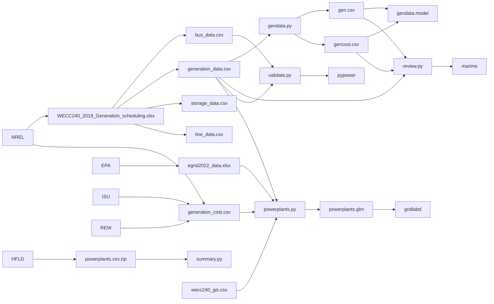

This folder contains the code to process price data from NREL's WECC 240 bus model and generate the cost data used for generation dispatch. 

*Source*: Jin Tan (jin.tan@nrel.gov)

# How To

## Setup

To setup a `venv` environent for this module do the following

    python3.12 -m venv .venv
    . .venv/bin/activate
    pip install --upgrade pip -r requirements.txt

## Processing

To update the `gen.csv` and `gencost.csv` files for `pypower`, run the following script

    python3 gendata.py

To update the GridLAB-D `powerplants.glm` file, run the following script:

    python3 powerplants.py

To obtain a summary of the powerplant data processed, run the following script:

    python3 summary.py

## Review

To review the results run the following marimo notebook

    marimo run review.py

## Validation

To validate the resulting generation data and cost model, run the following

    python3 validate.py

The output of this script is the result of the full AC OPF run in `pypower`.

## Python

To obtain the pypower `gen` and `gencost` data arrays in `python`, do the following:

    import gendata
    pp = gendata.model("generation_data.csv")

# Methodology

The goal of the files in the folder is to obtain the generator data and costs needed to run a WECC 240 simulation with an arbitrary load. To achieve this goal, an optimal power flow (OPF) must be solved to select which generators are dispatched and to what power level such that the production cost is minimized while (a) remaining with the generation fleet's operating limits, (b) remaining within the transmission network's capacity limits, (c) avoiding curtailment of loads, and (d) providing sufficient operating margin to ensure reliable system operation should a powerplant or transmission contingency occur.

The data provided includes a list of generation facilities and their respective price curves. A price curve is a series of prices and quantities at which they take effect. Normally price curves are monotonically increasing and represent the increasing cost of producing higher amounts of energy per unit time. However, not all generators have strictly monotonically increasing price curves. Some generators have zero costs for all production levels within their capability. Consequently when integrating a price curve to obtain a cost function one expects to obtain one of the following costs $C(q)$ for a given power dispatch $q$:

1. A constant non-negative cost curve, e.g., $C(q) = constant$.

2. A linear non-negative cost curve, e.g., $C(q) = P ~ q + constant$, where $P$ is the dispatch price.

3. A quadratic non-negative cost curve, e.g., $C(q) = R ~ q^2 + P ~ q + constant$, where $R$ is the scarcity rent of the facility.

There are cases where the generation cost curve obtained is not monotonically increasing and the resulting quadratic cost curve fit yields a negative value of $R$. Such non-convex cost function fits are relaxed by increasing the offending components of the price curve to ensure a monotonically increasing cost function.

## Data Flow

# Files

## Input Data

The input data files are

- `WECC240_2018_Generation_scheduling.xlsx`: This file contains the NREL WECC240 generation fleet data. This file's sheets are broken up into CSV files as follows:

    - `Bus`: -> `bus_data.csv`
    - `Generator`: -> `generation_data.csv`
    - `ESS`: -> `storage_data.csv`
    - `Line`: -> `line_data.csv`

- `egrid2022_data.xlsx`: This file contains the EPA generation fleet data. The `PLNT22` sheet is used to provide the following information about powerplants:

    - Facility name
    - County name
    - Facility latitude and longitude
    - Primary fuel type and category
    - Nameplate capacity

- `generation_cost.csv`: This file contains the generation costs by fuel and generator type. The file include a reference to the source of the cost data, which varies according to the generation type.

- `generation_types.csv`: This file contains the generation types corresponding to the `genname` suffixes. (Generators are named using the bus id and a generation type suffix, which can be used to determine what is the type of generator.) The following generator types are recognized: `steam`, `biomass`, `gas`, `geothermal`, `storage` (discharge), `solar`, `wind`, `hydro`, `nuclear`, and `dcline` (output).

- `counties.csv`: This file contains the county-level data used to identify where powerplants are and to which WECC240 node they should be connected.

- `powerplants.csv.zip`: This file contains the HFLD powerplant data used to generation the `powerplants.glm` file.

- `wecc240_gis.csv`: This file contains the WECC240 node data, including GIS data needed to locate nodes geographically.

## Intermediate Data

- `bus_data.csv`: This file comes from the `WECC240_2018_Generation_scheduling.xlsx` file and contains bus names, bus ids, and WECC region identifiers.  

- `generation_data.csv`: This file  comes from the `WECC240_2018_Generation_scheduling.xlsx` file and contains the generator cost data for each generator type at each bus.

- `line_data.csv`: This file comes from the `WECC240_2018_Generation_scheduling.xlsx` file and contains the transmission network data needed for the OPF constraints.

- `storage_data.csv`: This file comes from the `WECC240_2018_Generation_scheduling.xlsx` file and contains the energy storage resources in the WECC 240 model.

## Output Data

- `gen.csv`: This file contains the `pypower` generator data for each type of generator at each bus of the WECC 240 model. The file is updated by the `gendata.py` script.

- `gencost.csv`: This file contains the `pypower` generator costs for each type of generator at each bus of the WECC 240 model. The file is updated by the `gendata.py` script.

- `gencost.txt`: This file contains the console output from the `gendata.py` script when it updates the `gen.csv` and `gencost.csv` files. The output includes warnings about relaxations and other changes made to make the cost functions valid for processing by optimizers.

- `powerplants.glm`: This file contains the GridLAB-D powerplant objects for the WECC 240 model.

## Python Modules

- `gendata.py`: This module contains the `model` class used to process the `generation_data.csv` file and generation the `gen` and `gencost` data for `pypower`. The module also contain two functions by the same names to read the data files after they are generated by `model()` and saved. Note that they only read columns that are generated by `model()`--all other columns are defaulted to 0.

- `utils.py`: This module contains the GIS utilities needed to convert between latitude/longitude tuples and geohash location identifier strings.

## Python Scripts

- `gendata.py`: This script updates the `gen.csv` and `gencost.csv` data files for `pypower`.

- `powerplants.py`: This file generates the `powerplants.glm` file that contains the generation model for GridLAB-D based on the HFLD database.

- `summary.py`: This file outputs a summary of the powerplant data from the HFLD database used to generate the `powerplants.glm` file

- `validate.py`: This file outputs the result of running the full AC OPF in `pypower` using the new generation data and cost model.

## Marimo Notebooks

- `review.py`: This marimo notebook is used to review the results of the cost function fit to the generator cost data.

