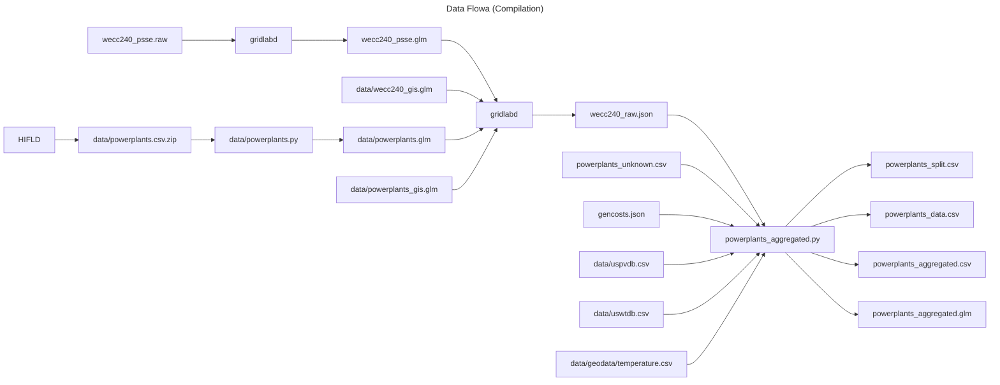
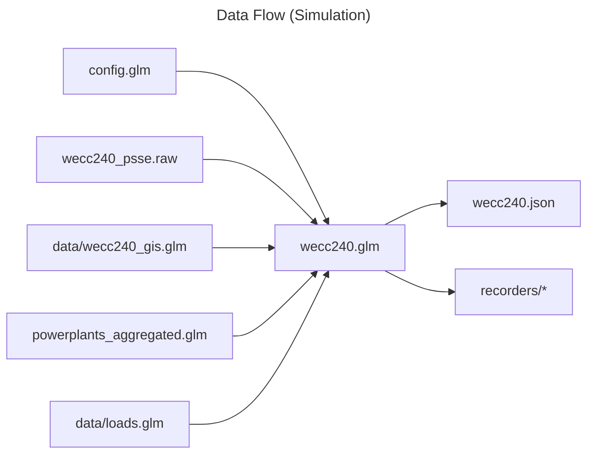

# Input Files

* `config.glm`: The main configuration file which sets up the scenario to simulation.
* `wecc240.glm`: The main model file which should be run with command `gridlabd wecc240.glm`.
* `wecc240_psse.raw`: The original PSS/E model, which is an input to the `wecc240.glm` model.
* `controllers.py`: The control system model in Python.

# Output Files

* `wecc240_psse.glm`: The WECC system `glm` file converted from the PSS/E `raw` file.
* `wecc240.json`: The final state of the system after the simulation is complete.
* `wecc240_failed_*.csv`: The solver data of the last failed solution, if any.

# Data Flow

