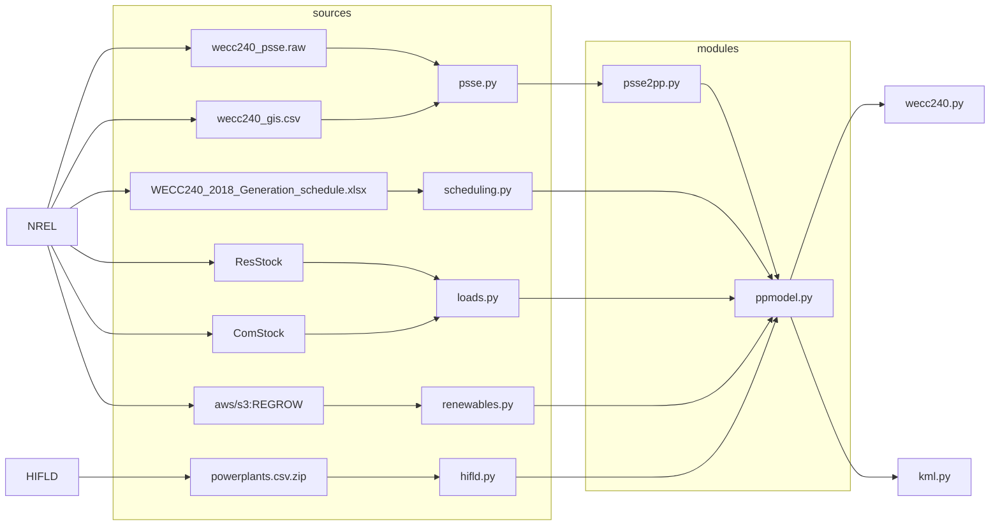
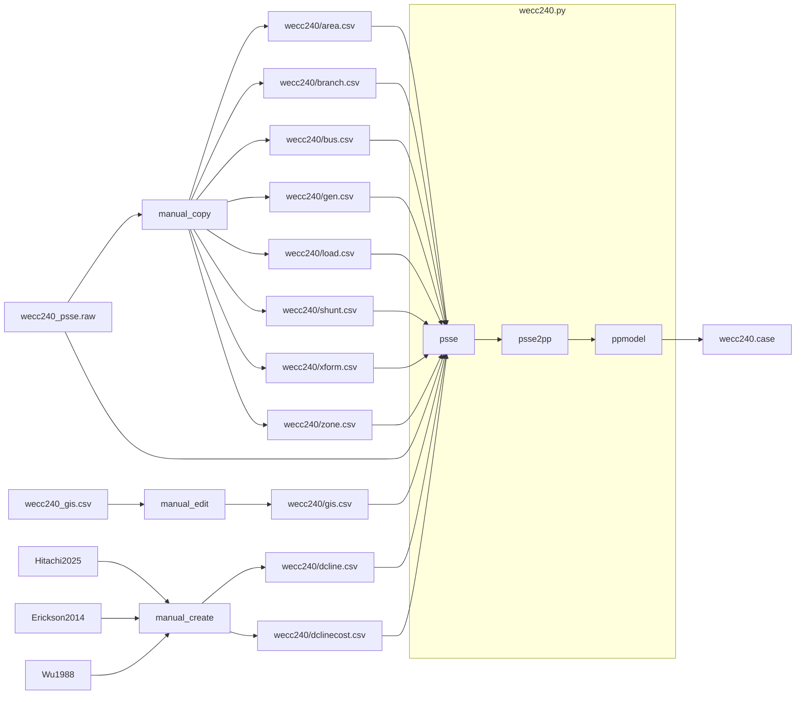
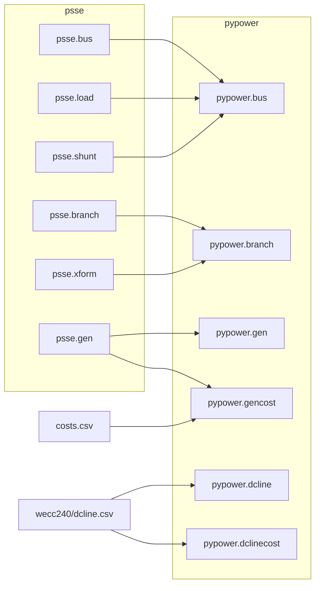
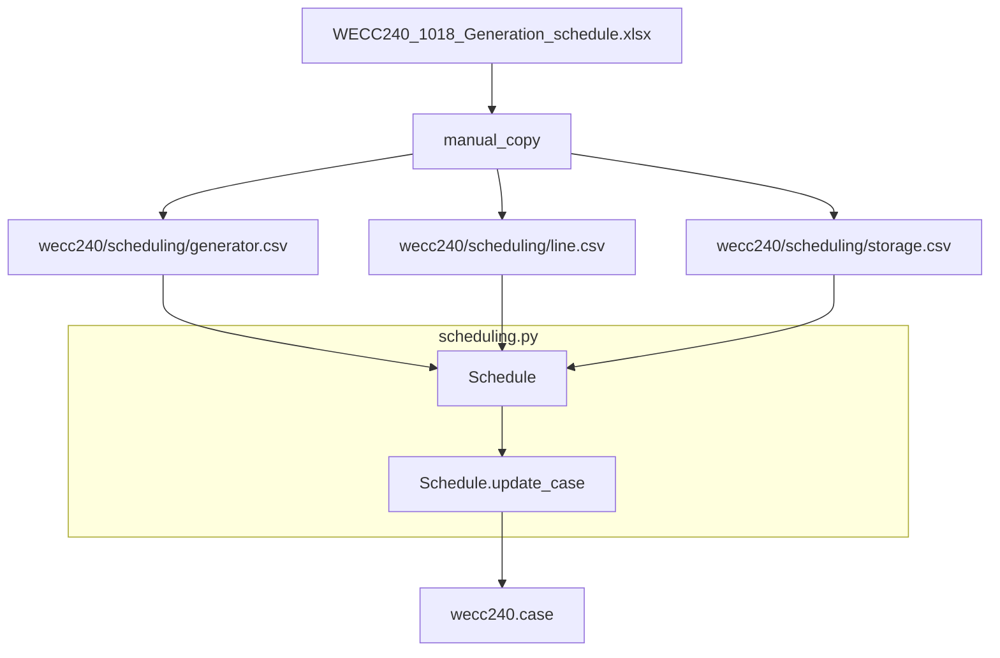
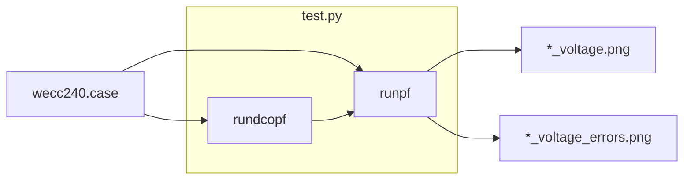

This folder contains the code and data needed to create the various PyPower models for the REGROW project.

# Quick Start

To create and run the `pypower` powerflow solution of a case, do the following:

    python3 -m venv .venv
    . .venv/bin/activate
    pip install --upgrade pip -r requirements.txt
    python3
    from ppmodel import PPModel
    from wecc240 import wecc240
    model = PPModel(case=wecc240)
    result =  model.run_timeseries(
        "2020-08-01 00:00:00+07:00",
        "2020-08-02 00:00:00+07:00",
        freq="1h",
        )


There are four options available to the case builder `wecc240()` to modify the original PSS/E model loaded by default:

- `wecc240(options=["SCHEDULING"])` imports the scheduling data in `WECC240_2018_Generation_schedule.xlsx`. Scheduling data overwrites the generation data and updates the branch and bus load data.

- `wecc240(options=["HIFLD"])` imports the generation fleet in the `powerflow.csv.zip` file. HIFLD data overwrite the generation data.

- `wecc240(options=["LOADS"])` imports the load model from NREL [ResStock](https://resstock.nrel.gov/) and [ComStock](https://comstock.nrel.gov/). Load data overwrite the bus load data.

- `wecc240(options=["RENEWABLES"])` imports the renewables generation from the NREL REGROW S3 bucket. Renewables overwrites the renewable generation data.

To load the original PSS/E model, use the following

    case = wecc240()

To load the PSS/E with the scheduling data, use the following:

    case = wecc240(options["SCHEDULING"]

To load the REGROW model at 20:00 UTC on August 15, 2020, use the following:

    case = wecc240(options=[HIFLD","LOADS","RENEWABLES"],datetime="2020-08-15 20:00:00+00:00")

See [rwl/PYPOWER on GitHub](https://github.com/rwl/PYPOWER) for details on running PyPower cases.

# WECC240 Model Preparation

The WECC240 model in PyPower is prepared using the following high-level data flow:



# PSS/E to PyPower Model Conversion

The data flow is as follows:



## Methodology

### PSSE Segments

The PSSE data segments are extract manually as follows:

- **AREA** $\to$ `wecc240_area.csv`
- **BRANCH** $\to$ `wecc240_branch.csv` $\to$ `psse.branch`
- **BUS** $\to$ `wecc240_bus.csv` $\to$ `psse.bus`
- **GEN** $\to$ `wecc240_gen.csv` $\to$ `psse.gen`
- **LOAD** $\to$ `wecc240_load.csv` $\to$ `psse.load`
- **SHUNT** $\to$ `wecc240_shunt.csv` $\to$ `psse.shunt`
- **XFORM** $\to$ `wecc240_xform.csv` $\to$ `psse.xform`
- **ZONE** $\to$ `wecc240_zone.csv`

The segment files must be edited manually to clean the header names and remove extra whitespaces in strings. In addition, the transformer segment (`XFORM`) must be edited to merge the multiline entries and remove the extra columns that are not included in the data segment.

A segment for `DCLINE` must be manual constructed to provide the real definitions of the PDCI and Intermountain SST lines. The corresponding negative and positive loads at busses 4007 and 2619 (PDCI) and 2600 and 2601 (Intermountain SST) must also be removed manually from the load segment.

### PSSE to PP converter

The `psse2pp` converter converts the PSSE segments into pypower blocks as follows:



#### DC Lines

In the original PSS/E model, the DC line are modeled as the following loads. 

| Bus Number | Bus Name | Load MW    | DC Line Name | Terminal |
| ---------: | -------- | ------:    | ------------ | -------- |
|       4010 | CELILO   |  2,904.493 | PDCI         | North    |
|       2619 | SYMLARLA | -2,466.528 | PDCI         | South    |
|       2600 | ADELANTO | -1,591.978 | IMSST        | South    |
|       2604 | INTERMT  |  1,791.945 | IMSST        | North    |

These loads have been replaced with DC lines in the PyPower model, as described in `wecc240_dcline.csv`. The constraints and losses for the DC lines are obtained from the corresponding references (see [Eriksson 2014](https://publisher.hitachienergy.com/download?DocumentID=9AKK106103A8918&LanguageCode=en&DocumentPartId=&Action=download&DocumentRevisionId=-&parentURL=68747470733a2f2f7075626c69736865722e68697461636869656e657267792e636f6d2f646f63756d656e74733f646f63547970653d416c6c25323046696c657326713d70616369666963253230696e746572746965) and [Wu 1988](https://ieeexplore.ieee.org/document/193910)).

| DC Line Name | Converter Loss | Line Loss | Voltage From | Voltage To | Minimum Power | Maximum Power | Minimum Reactive North | Maximum Reactive North | Minimum Reactive South | Maximum Reactive South |
| ------------ | -------------: | --------: | -----------: | ---------: | ------------: | ------------: | ---------------------: | ---------------------: | ----------------------: | ---------------------: |
| PDCI         |          20.77 |     1.38% |        1.075 |      1.012 |         -3100 |          3100 |                  -2000 |                   2000 |                  -2000 |                   2000 |
| IMSST        |             25 |     0.86% |        1.030 |      1.056 |             0 |          2400 |                   -100 |                    100 |                   -100 |                    100 |

The IMSST power ratings are based on the upgrade reported in the [Hitachi Project Summary](https://www.hitachienergy.com/us/en/news-and-events/customer-stories/intermountain-power-project). The voltage settings are imported from the PSS/E model. IMSST converter station losses were not found in the available public literature and are estimated based on PDCI converter station losses.

The DC line costs are listed in the `costs.csv`.

### PyPower Solvers

Three solver tests are performed on the resulting model:

- Powerflow (runpf)
- DC Optimal Powerflow (rundcopf)
- AC Optimal Powerflow (runopf)

## Modeling Options

External data can be included in the WECC240 model using the `options:list` keyword when calling the `wecc240()` method.  The following options are available:

#### `SCHEDULING`

Include the `SCHEDULING` option to update the case using the generation cost data from `WECC240_1018_Generation_schedule.xlsx` file extracted manually into the `wecc240_schedule_*.csv` files, which provide generator, line, and storage scheduling data.

The scheduling data is prepared and used to update cases as follows:



Note that this option is mutually exclusive with the `HIFLD` option.

#### `HILFD`

Includes the `HIFLD` option to replace the generation fleet with the generators in the `powerplants.csv.zip` file using the following data flow:

```mermaid
flowchart LR

    HIFLD --> powerplants.csv.zip
    PSSE --> wecc240/bus.csv
    NREL --> wecc240/gis.csv

    powerplants.csv.zip --> HIFLD.powerplants
    wecc240/bus.csv --> HIFLD.powerplants
    wecc240/gis.csv --> HIFLD.powerplants

    subgraph hifld.py
        HIFLD.powerplants
    end

    HIFLD.powerplants --> wecc240.case
 ```

Testing of the HIFLD powerplant import process yields the following results:

| Test case | All HIFLD Plants | No PV, WT, UNKNOWN |
| :-------- | ---------------: | -----------------: |
| Operating Capacity | 213.8 GW | 176.6 GW |
| Winter Capacity | 203.0 GW | 166.4 GW |
| Summer Capacity | 199.4 GW | 162.6 GW |
| Aggregated Plants | 369 | 272 |
| Connected Busses | 53 | 53 |
| Operating Margin | 37.1% | 23.8% |
| Winter Margin | 33.7% | 19.1% |
| Summer Margin | 32.5% | 17.2% |

#### `EIA Form 860`

Includes the EIA Form 860m option to replace the generation fleet with generators listed in the monthly EIA Form 860 data online using the following data flow:

```mermaid
flowchart LR

    EIA --> EIA860

    subgraph eia860m.py
        EIA860
    end

    EIA860 --> cache
    cache --> EIA860

    EIA860 --> ppgen

    subgraph ppgen.py
        ppgen --> ppgen.gen
        ppgen.gen --> ppgen.gencost
        ppgen --> ppgen.to_kml
    end

    WECC240 --> ppgen

    generation_costs.csv --> ppgen.gencost

    subgraph summaries.py
        ppgen --> eia860m_node_assignment
        ppgen.gen --> summaries/eia860m_nodes.csv
        ppgen.to_kml --> summaries/eia860m_nodes.kml
        eia860m_node_assignment
    end
    
    subgraph pypower
        ppgen.gen --> pypower.case
        ppgen.gencost --> pypower.case
        pypower.case --> runpf
        pypower.case --> runopf
    end

    eia860m_node_assignment --> summaries/eia860m_node_assignment.csv
    runpf --> summaries/eia860m_node_assignment.csv
    runopf --> summaries/eia860m_node_assignment.csv
```

The cache file is stored in `wecc240/powerplants/eia860m_{date}.csv.gz`, where `date` is formatted as `YYYY-MM-DD`. Consequently, EIA Form 860m generation fleet data can change from one month to the next and is valid only for the year and month specified.

#### `LOADS` (future work)

Includes the `LOADS` option to replace the loads with the load model from NREL RESSTOCK and COMSTOCK loads. Note that using the load model requires the `datetime` option be specified.

#### `RENEWABLES` (future work)

Include the `RENEWABLES` optio to replace the renewable generation fleet with the NREL REGROW generation fleet.

## Result Check

The results of the powerflow solver as compared to the original input from PSS/E using the `voltage.png` and `voltage_errors.png`.  The former does a side-by-side comparison of each bus and the latter sorts the bus voltage and angle errors in descending order. This comparison is done for the AC powerflow of the original model compared to the original model (`tests/original_voltage_*.png`) and AC powerflow solution of the DC OPF solution compared to the original model (`tests/original_dcopf_voltage_*.png)`.



# Code Checking

You can check the code using the `pylint` target of the `Makefile`, e.g.,

    make pylint

## GitHub Actions

When a code update is pushed, GitHub actions workflow `pypower.yaml` will perform the `pylint` code check with a failure threshold of 9.0. In addition, the `tests` folder is available as a downloadable artifact.
