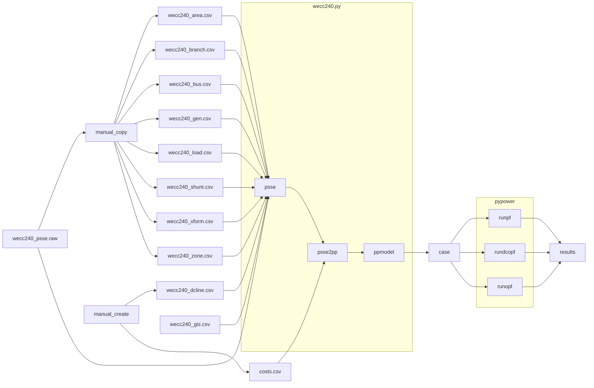
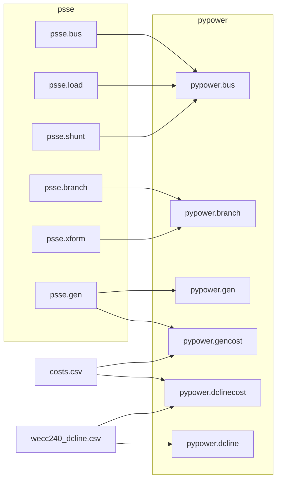

# PSS/E to PyPower Model Conversion

The data flow is as follows:

## Methodology

### PSSE Segments

The PSSE data segments are extract manually as follows:

- **AREA** $\to$ `wecc240_area.csv`
- **BRANCH** $\to$ `wecc240_branch.csv` $\to$ `psse.branch`
- **BUS** $\to$ `wecc240_bus.csv` $\to$ `psse.bus`
- **GEN** $\to$ `wecc240_gen.csv` $\to$ `psse.gen`
- **LOAD** $\to$ `wecc240_load.csv` $\to$ `psse.load`
- **SHUNT** $\to$ `wecc240_shunt.csv` $\to$ `psse.shunt`
- **XFORM** $\to$ `wecc240_xform.csv` $\to$ `psse.xform`
- **ZONE** $\to$ `wecc240_zone.csv`

The segment files must be edited manually to clean the header names and remove extra whitespaces in strings. In addition, the transformer segment (`XFORM`) must be edited to merge the multiline entries and remove the extra columns that are not included in the data segment.

A segment for `DCLINE` must be manual constructed to provide the real definitions of the PDCI and Intermountain SST lines. The corresponding negative and positive loads at busses 4007 and 2619 (PDCI) and 2600 and 2601 (Intermountain SST) must also be removed manually from the load segment.

### PSSE to PP converter

The `psse2pp` converter converts the PSSE segments into pypower blocks as follows:

#### DC Lines

In the original PSS/E model, the DC line are modeled as the following loads. 

| Bus Number | Bus Name | Load MW | DC Line Name |
| ---: | ---- | ----: | ------- |
| 4010 | CELILO | 2,904.493 | PDCI |
| 2619 | SYMLARLA | -2,466.528 | PDCI |
| 2600 | ADELANTO | -1,591.978 | IMSST |
| 2604 | INTERMT | 1,791.945 | IMSST |

These have be replace with DC lines in the PyPower model, as described in the `wecc240_dcline.csv`. The constraintsWe for the DC lines are obtained from the corresponding references (see Eriksson 2014 and Wu 1988).

The DC line costs are listed in the `costs.csv`.

### PyPower Solvers

Three solver tests are performed on the resulting model:

- Powerflow (runpf)
- DC Optimal Powerflow (rundcopf)
- AC Optimal Powerflow (runopf)
